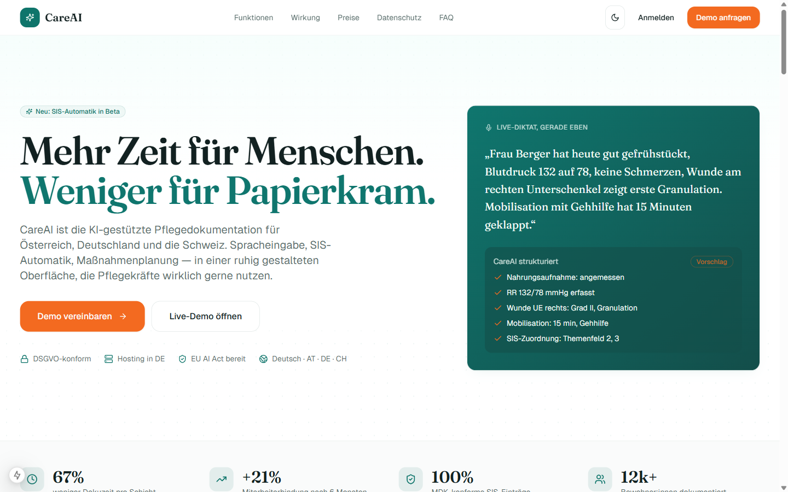
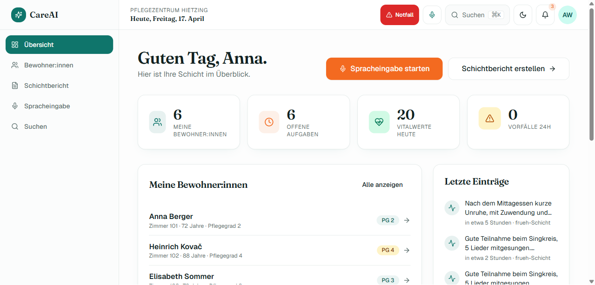
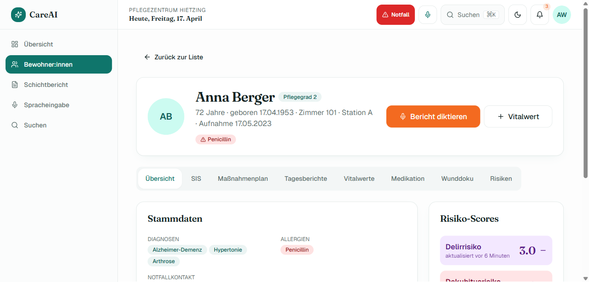
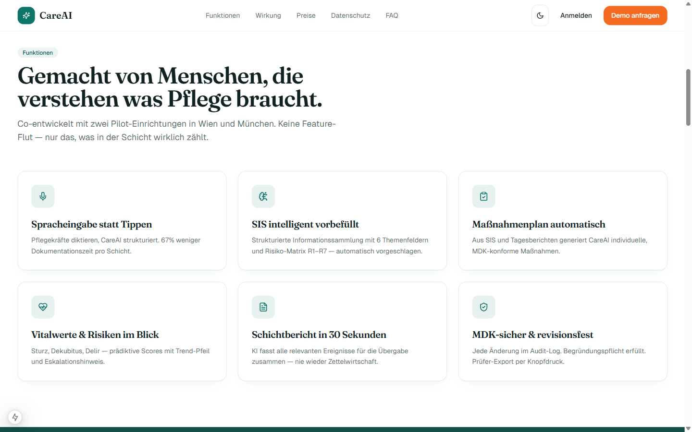
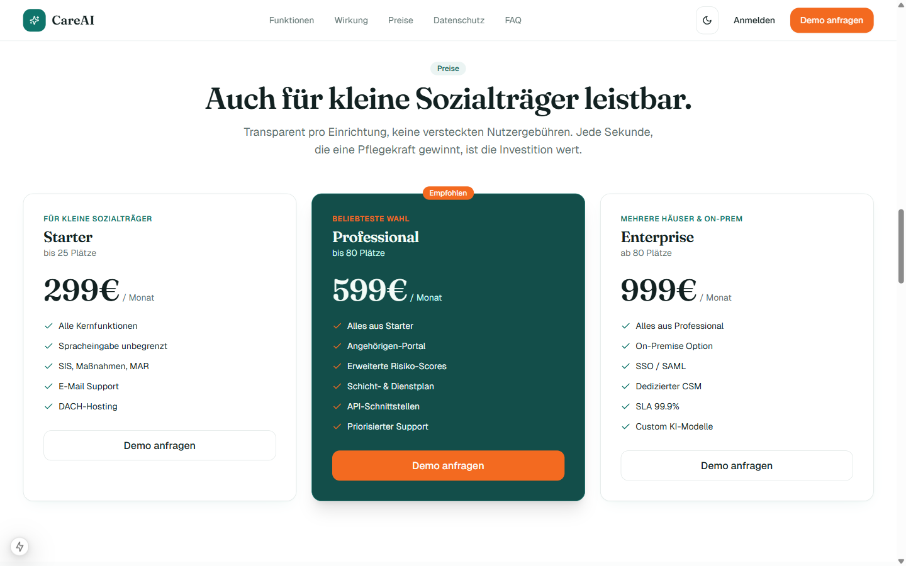
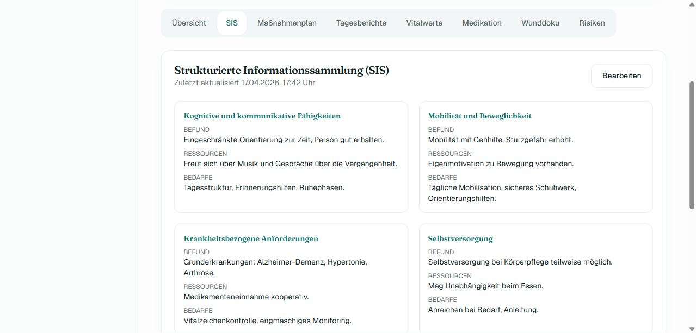

# CareAI — KI-gestützte Pflegedokumentation

> Pflegekräfte sprechen. CareAI dokumentiert. MDK-fest, DSGVO-sauber, EU-AI-Act-konform.


-0F766E)


---

## Was ist CareAI

**Das Problem.** In deutschsprachigen Pflegeeinrichtungen verbringen Fachkräfte zwischen 25 % und 40 % ihrer Schicht mit Dokumentation — Zeit, die am Bett fehlt. Der Fachkräftemangel ist akut, Bürokratieaufwand nach § 113c SGB XI und MDK-Prüfungen belasten die Teams, und die Einführung von SIS (Strukturierte Informationssammlung) hat die Anforderungen nicht verringert, sondern verlagert.

**Die Lösung.** CareAI ist ein vollständig integriertes Web- und Mobile-Produkt, das vier Innovationsebenen zusammenführt: (1) Spracheingabe mit automatischer SIS-Strukturierung, (2) Human-in-the-Loop-Absicherung nach EU AI Act, (3) revisionsfestes Audit-Log für MDK/MD-Prüfungen nach § 113 SGB XI, (4) Angehörigen-Portal mit echtem Mehrwert (Wohlbefindens-Score, Aktivitäten, Timeline). Ergänzt um Dienstplan-Solver, Kiosk-Tablet-Modus, Wundverlauf-Zeitraffer, FHIR/GDT/ELGA-Integration und ein Lernmanagement-System.

**Der Impact.** Bei einer durchschnittlichen stationären Einrichtung (80 Bewohner:innen, 40 VZÄ) rechnet CareAI mit ca. 1,2 zurückgewonnenen Stunden pro Schicht pro Pflegekraft — das sind ~9.500 zusätzliche Pflegestunden pro Jahr, ohne zusätzliches Personal.

---

## Screenshots

| Marketing-Hero | Dashboard | Bewohner-Detail |
|---|---|---|
|  |  |  |

| Features | Pricing | SIS-Ansicht |
|---|---|---|
|  |  |  |

Weitere Screenshots unter [`docs/screenshots/`](docs/screenshots/).

---

## Features im Überblick

### Pflegekraft-App (`/app`)

| Feature | Status | Pfad |
|---|---|---|
| Dashboard mit Heute-Übersicht | prod | `src/app/(app)/app/page.tsx` |
| Bewohner-Liste + Detail (SIS, Maßnahmen, Vitalwerte, MAR, Wunddoku) | prod | `src/app/(app)/app/bewohner/` |
| Spracheingabe mit KI-Strukturierung | mock | `src/app/app/voice/` |
| Schichtbericht-Generator | mock | `src/app/(app)/app/schichtbericht/` |
| Command-Palette (Cmd+K) | prod | `src/components/app/` |
| Offline-Sync (IndexedDB-Queue) | beta | `src/lib/offline/` |
| Wundverlauf-Zeitraffer | beta | `src/components/wound/` |
| Voice-Commands (WebSpeech) | beta | `src/lib/voice-commands/` |

### Admin + Compliance (`/admin`)

| Feature | Status | Pfad |
|---|---|---|
| Revisionsfestes Audit-Log | prod | `src/lib/audit.ts`, `src/app/admin/audit/` |
| RBAC (Admin/PDL/Pflege/Familie) | prod | `src/lib/rbac.ts` |
| Dienstplan-Solver (Constraint-basiert) | beta | `src/lib/scheduling/solver.ts` |
| Anomalie-Erkennung | beta | `src/lib/anomaly/` |
| Multi-Tenant-Benchmarks | alpha | `src/lib/multi-tenant/` |
| Qualitätsindikatoren (§ 113) | beta | `src/lib/quality-benchmarks/` |
| Incident-Post-Mortem | beta | `src/app/admin/incidents/` |
| Impersonation für Support | beta | `src/lib/impersonation/` |
| Press-Release-Generator (5 Templates, Live-Preview, Quality-Score) | prod | `src/app/admin/press-release/` |
| A11Y-Audit (In-App) | beta | `src/app/admin/a11y-audit/` |
| Performance-Baseline | beta | `src/app/admin/performance/` |
| AI-Training Datasets | beta | `src/app/admin/ai-training/` |
| Guided Tours (In-App-Onboarding) | prod | `src/app/admin/tours/` |
| A/B-Testing-Plattform (Chi-Quadrat, Winner-Picking) | prod | `src/app/admin/ab-testing/` |
| Marketing-Automation (Trigger/Conditions/Actions) | prod | `src/app/admin/marketing-automation/` |
| CRM-Sync (HubSpot/Pipedrive, bidirektional) | prod | `src/app/admin/crm-sync/` |

### Integrationen

| Standard | Status | Pfad |
|---|---|---|
| HL7 FHIR R4 (Patient, Observation) | alpha | `src/lib/integrations/fhir/` |
| GDT (xDT Export) | alpha | `src/lib/integrations/gdt/` |
| ELGA (AT) | stub | `src/lib/integrations/elga/` |
| DTA § 302 SGB V | stub | `src/lib/integrations/dta/` |
| KIM (Kommunikation im Medizinwesen) | stub | `src/lib/integrations/kim/` |
| Whisper / Claude Voice | stub | bereit für API-Key |

### Mobile Apps

| App | Status | Pfad |
|---|---|---|
| Pflegekraft-App (Expo) | alpha | `mobile/` |
| Angehörigen-App (Expo) | alpha | `mobile-family/` |
| Kiosk-Tablet-Modus | prod | `src/app/(kiosk)/` |

### Trust + Sicherheit

| Feature | Status | Pfad |
|---|---|---|
| Row-Level-Security Multi-Tenancy | prod | `src/db/schema.ts` |
| Auth.js v5 (JWT, Credentials) | prod | `src/lib/auth.ts` |
| CSP + Security-Header | prod | `src/lib/security/csp.ts` |
| Anonymizer (DSGVO-Export) | beta | `src/lib/anonymizer/` |
| Backup-Strategie (PITR) | doku | `docs/BACKUP-STRATEGY.md` |
| Disaster-Recovery-Playbook | doku | `docs/DISASTER-RECOVERY.md` |

---

## Quick Start

```bash
npm install
cp .env.example .env              # DATABASE_URL, AUTH_SECRET setzen
npm run db:push                   # Schema pushen (Drizzle)
npm run db:seed                   # 12 Bewohner, 200+ Audit-Events, 5 Pflegekräfte
npm run dev                       # → http://localhost:3000
```

Danach: **[`SHOWCASE.md`](SHOWCASE.md)** (30+ Highlight-Features) und **[`docs/FINAL-TOUR.md`](docs/FINAL-TOUR.md)** (12-Stops-Rundgang) durchklicken.

Ohne Postgres? Die eingebundene `local.db` (SQLite) lädt out-of-the-box. Für Postgres lokal:

```bash
docker run --name careai-pg -e POSTGRES_PASSWORD=postgres -p 5432:5432 -d postgres:16
```

---

## Demo-Logins

Passwort für alle: **`Demo2026!`**

| Rolle | E-Mail | Landing |
|---|---|---|
| Administrator:in | `admin@careai.demo` | `/admin` |
| Pflegedienstleitung | `pdl@careai.demo` | `/admin` |
| Pflegekraft | `pflege@careai.demo` | `/app` |
| Pflegekraft (alt.) | `pflege2@careai.demo` … `pflege5@careai.demo` | `/app` |
| Angehörige:r | `familie@careai.demo` | `/family` |

---

## Projekt-Struktur

```
CareAI-App/
├── src/
│   ├── app/              Next.js 15 App-Router (136 Routes)
│   │   ├── (marketing)   Blog, Case-Studies, Presse, Karriere, Pricing (DE + /en Subtree)
│   │   ├── (auth)        Login, Signup, Verify, Forgot-Password
│   │   ├── (app)/app     Pflegekraft-Bereich
│   │   ├── (investors)   Pitch, Data-Room, Cap-Table, Financial-Model
│   │   ├── (kiosk)       Touch-optimierter Stations-Tablet-Modus
│   │   ├── (onboarding)  Wizard für Neukunden
│   │   ├── admin         Admin + PDL
│   │   ├── family        Angehörigen-Portal
│   │   ├── lms           Lernmanagement-System
│   │   ├── telemedizin   Telemedizin-Sprechstunde
│   │   ├── partner       Partner-Programm
│   │   ├── subunternehmer Subcontractor-Portal
│   │   └── api           REST-Endpoints
│   ├── components/       UI-Primitives, App-, Marketing-, Wound-Komponenten
│   ├── db/               Drizzle Schema, Seed, Bootstrap
│   ├── lib/              Business-Logik (Audit, Auth, RBAC, KI-Adapter, Solver, …)
│   └── types/            Ambient TypeScript
├── content/
│   ├── blog/             15 SEO-Blog-Artikel (Markdown)
│   ├── lms/              E-Learning-Module
│   ├── glossar/          Fachbegriffe
│   ├── demo-video/       Demo-Skript + Assets
│   └── investor-outreach/ Pitch-Material
├── docs/                 24 Technik- und Produkt-Docs
├── emails/               React Email Templates
├── e2e/                  Playwright Tests (a11y, Lighthouse, Workflows)
├── tests/                Vitest Unit-Tests
├── mobile/               Expo Pflegekraft-App
└── mobile-family/        Expo Angehörigen-App
```

---

## Architektur-Highlights

- **Stack:** Next.js 15 (App Router, RSC) · React 19 · TypeScript strict · Drizzle ORM · Auth.js v5 · Tailwind 3 + shadcn/ui · Recharts · Framer Motion · Sonner · cmdk
- **Multi-Tenancy:** Row-Level-Security per `facility_id`-Scope; Benchmarks über anonymisierte Cross-Tenant-KPIs
- **Audit-Log:** Append-only Tabelle `audit_events` mit Hash-Chain (jedes Event speichert Hash seines Vorgängers → MDK-fest)
- **Human-in-the-Loop:** Jede KI-Empfehlung wird als Vorschlag präsentiert, nie automatisch ausgeführt — das ist unser MDR-/AI-Act-Schutz
- **PGlite embedded:** Zero-Install-Demo über eine mitgelieferte `local.db`, kein Postgres nötig für erste Erkundung
- **Offline-First (Mobile):** Queue-basierte IndexedDB-Sync, konfliktfrei dank Last-Write-Wins mit Server-Tiebreaker

---

## Compliance

CareAI adressiert die relevanten regulatorischen Rahmen im DACH-Pflegemarkt:

- **DSGVO** (insb. Art. 9 — besondere Kategorien / Gesundheitsdaten)
- **EU AI Act** — Klassifizierung als Hochrisiko-KI (Anhang III), Human-in-the-Loop, Transparenzpflichten, Logging
- **SGB XI** — insb. § 113 (Qualitätssicherung) und § 113c (Personalbemessung)
- **GuKG** (AT) — Dokumentationspflichten nach Gesundheits- und Krankenpflegegesetz
- **§ 113 SGB XI** Qualitätsindikatoren — automatisierte Berechnung der MDK-Indikatoren
- **HinSchG** — Hinweisgebersystem für Beschäftigte
- **BFSG / EN 301 549** — Barrierefreiheit nach WCAG 2.1 AA
- **ISO 13485 / MDR** — Produkt-Lifecycle-Dokumentation (in Vorbereitung)

Details unter [`docs/SECURITY.md`](docs/SECURITY.md).

---

## Roadmap

| Quartal | Meilenstein |
|---|---|
| Q2 2026 | Pilot mit 3 Wiener Pflegeheimen, Whisper-Live-Verkabelung, ELGA-Zertifizierung Phase 1 |
| Q3 2026 | Österreich-Rollout (10+ Einrichtungen), aws Preseed abgeschlossen, ISO 27001 Stage 1 |
| Q4 2026 | Deutschland-Eintritt (Pilot Bayern + NRW), Seed-Runde 2,5 M€, KIM-Anbindung live |
| Q1 2027 | EU-AI-Act-Hochrisiko-Zertifizierung Phase 2, Multi-Einrichtungs-Benchmark-Produkt |
| Q2 2027 | Schweiz-Launch, ambulant-mobile App (Sozialstationen), FHIR-R5-Upgrade |

Detaillierter Plan: siehe [`ROADMAP.md`](ROADMAP.md).

---

## Produktion

CareAI ist **production-grade ready** für Multi-Tenant-Rollout. Operations-Assets:

- **Hetzner-Deploy** — Cloud-Server-Setup, Docker-Compose, TLS: [`docs/DEPLOYMENT.md`](docs/DEPLOYMENT.md)
- **Installer-Script** — Ein-Kommando-Installation für Pilot-Heime: [`docs/INSTALLER.md`](docs/INSTALLER.md)
- **Grafana-Monitoring** — Dashboards, Alerts, Prometheus-Scraper: [`docs/MONITORING.md`](docs/MONITORING.md)
- **Disaster-Recovery-Drill** — RTO/RPO-Playbook + regelmäßiger Drill: [`docs/DISASTER-RECOVERY.md`](docs/DISASTER-RECOVERY.md)
- **Load-Testing + Pentest + Smoke-Tests** — [`docs/LOAD-TESTING.md`](docs/LOAD-TESTING.md), [`docs/PENTEST-CHECKLIST.md`](docs/PENTEST-CHECKLIST.md), [`docs/SMOKE-TESTS.md`](docs/SMOKE-TESTS.md)
- **Runbooks + Support-Playbooks** — [`docs/runbooks/`](docs/runbooks/), [`docs/support/`](docs/support/)
- **CE-MDR-Pipeline + Clinical-Validation** — [`docs/regulatory/`](docs/regulatory/), [`docs/clinical/`](docs/clinical/)

---

## Dokumentation

Siehe [`docs/INDEX.md`](docs/INDEX.md) für die komplette Übersicht. Kernreferenzen:

- [`docs/ARCHITECTURE.md`](docs/ARCHITECTURE.md) — Komponentenaufbau, Datenfluss, Entscheidungen
- [`docs/SECURITY.md`](docs/SECURITY.md) — DSGVO, EU AI Act, Verschlüsselung, Audit
- [`docs/DEMO-SCRIPT.md`](docs/DEMO-SCRIPT.md) — Investor-Demo Step-by-Step
- [`docs/FINAL-TOUR.md`](docs/FINAL-TOUR.md) — Feature-Rundgang für Stakeholder
- [`SHOWCASE.md`](SHOWCASE.md) — Die 20 eindrucksvollsten Features auf einen Blick
- [`CHANGELOG.md`](CHANGELOG.md) — Wave-für-Wave Entwicklungs-Chronik

---

## Entwicklung

```bash
npm run dev          # Next.js Dev-Server
npm run build        # Produktions-Build
npm run typecheck    # tsc --noEmit
npm run lint         # next lint
npm run test         # Vitest Unit-Tests
npm run test:e2e     # Playwright E2E
npm run test:a11y    # Accessibility-Tests
npm run db:studio    # Drizzle Studio
npm run email:dev    # Email-Template-Vorschau auf :3333
```

**Debug-Setup:** VS Code Launch-Config liegt unter `.vscode/launch.json` (Server- + Client-Debug kombiniert).

**Contribution:** PRs gegen `main`. Jeder PR erfordert grüne Tests (`npm run test && npm run test:e2e`) und eine Review. Kleine Commits, deutsche Commit-Messages zulässig, englisch bevorzugt für Code.

---

## Lizenz + Impressum

Proprietär — © 2026 CareAI GmbH (in Gründung). Demo-Code für Förder- und Investor-Zwecke. Impressum und AGB siehe `/impressum` und `/agb` im laufenden System.

---

## Danksagung

CareAI steht auf den Schultern großartiger Open-Source-Projekte: Next.js, React, Drizzle, Auth.js, Tailwind, shadcn/ui, Radix UI, Lucide, Recharts, Framer Motion, Sonner, cmdk, React Email, Playwright, Vitest, Expo, Zod, React Hook Form und viele weitere. Danke an alle Maintainer:innen.
